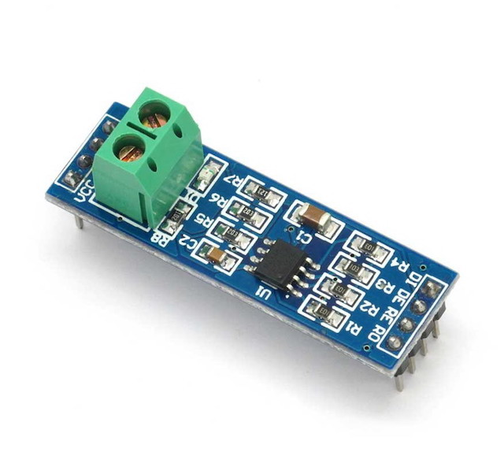
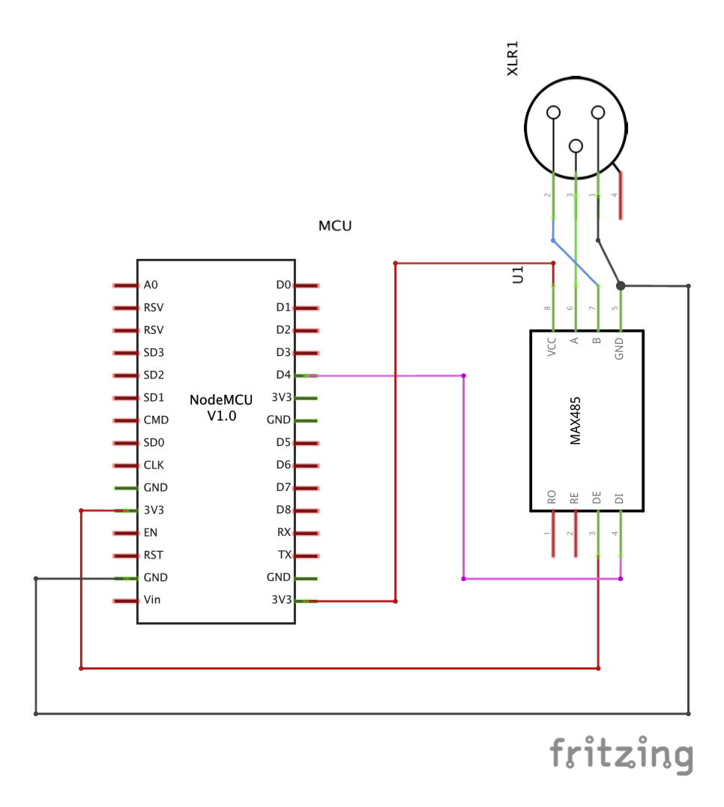

# ESP8266 / ESP32 to DMX over MAX485
An example on how to send dmx over a max485 with an ESP8266 or ESP32.

### Important
The library uses multiple Serial protocols which is **very** slow! I am using a new library for the `ESP32`, which does the protocol change directly through chaning the registers. Please take a look at the library here ([LXESP32DMX](https://github.com/bildspur/til/tree/master/src/controller/driver/LXESP32DMX)). Here is an example on how to use it ([DMXLightRenderer.h](https://github.com/bildspur/til/blob/master/src/controller/renderer/DMXLightRenderer.h))

### Library
- [DMX Library for Arduino with ESP8266](https://github.com/Rickgg/ESP-Dmx)

### MAX485 to RS485 MCU

### Circuit for NodeMCU V1.0
*Caution: This is just an example that worked for me. Have a look at [#1](https://github.com/cansik/esp-dmx-max485/issues/1) for more information about safe wiring!*

